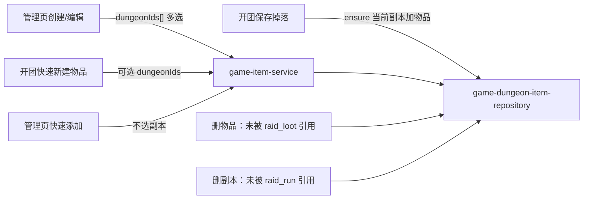

# 物品掉落副本关联

实现计划（已落地，migrate 需确认后再跑）。物品和副本是多对多：一件物品可以掉自多个副本。用关联表 `game_dungeon_item` 表达；关联作为物品 CRUD 的嵌套字段（`dungeonIds`），不单独做掉落池管理页或新 HTTP resource。

管理页创建/编辑时用**多选**副本下拉。物品管理**列表**用同一组件的**单选**按副本过滤（可清空看全部）。

开团页保存掉落：可选用其他副本已建的物品；保存时为**当前开团副本**补一条关联（幂等），表示该物品在这里也会掉落。



## 实现清单

- [x] Schema `game_dungeon_item`、导出，并 `db:generate`（migrate 需确认后再跑）
- [x] Repository + 物品/副本 service：替换关联、list/detail 回填、级联删除、create/update/quick 可选 `dungeonIds`
- [x] 开团保存掉落时 `ensure(当前副本, 物品)`，选用已有物品也补关联
- [x] 抽出副本标签 helper；下拉组件迁到 `src/components`，并用 `multiple` 参数支持单选/多选
- [x] 管理页创建/编辑用 `multiple` 选掉落副本；表格展示；列表按副本单选过滤
- [x] 管理列表按 `dungeonId` 过滤；开团搜索全局但当前副本物品排前
- [x] 开团快速新建物品可带 `dungeonIds`；选已有物品由后端 loot save `ensure`
- [x] 更新 game-item / game-dungeon / raid-loot 的 service 与 route 测试
- [x] 跑各包 `check` / `typecheck` / `test`；确认前不 migrate

## Schema

新文件 `packages/db/schema/dungeon-item.ts`，从 `packages/db/schema/index.ts` 再导出。

- 表名 `game_dungeon_item`：`id`、`dungeon_id`、`item_id`、`created_at`、`updated_at`（遵循 db-schema-conventions：无物理外键）。
- `(dungeon_id, item_id)` 唯一，并各建索引。
- `bun run --filter @sidui/db db:generate`。**确认前不跑 `db:migrate`。**

## API：挂在物品上，不新增 resource

仓库 `apps/api/src/infrastructure/repository/game-dungeon-item-repository.ts`：

- `findDungeonsByItemIds(itemIds)`：批量 join `game_dungeon`（`id`、`name`、`playerLimit`、`difficulty`、`bossCount`），供 list/编辑回填。
- `replaceForItem(itemId, dungeonIds)`：先删后插；空数组表示无关联。
- `ensure(dungeonId, itemId)`：已有则忽略，没有则插入（开团保存掉落用，幂等）。
- `deleteByItemId` / `deleteByDungeonId`。

Service：`game-item-service.ts`、`game-dungeon-service.ts`

- 复用 `gameDungeonRepository.findByIds`（同 `app-setting-service.ts` 的 `assertDungeonsExist`）。缺失 ID → `GAME_DUNGEON_NOT_FOUND`；ID 去重。
- `createAdminGameItem` / `quickCreateGameItem`：可选 `dungeonIds`，默认 `[]`。
- `updateAdminGameItem`：传入 `dungeonIds`（含 `[]`）则全量替换；省略则不动关联。
- `listAdminGameItems` / `getAdminGameItem`：detail 带上 `dungeons`（编辑弹窗用的是列表行，不是 `GET /:id`）。
- `searchGameItems`：可选 `dungeonId`。仍按名称全局搜，有值时**先排当前副本已关联物品**，再排其余（组内保持现有精确名 > 前缀 > 其他）。`GameItemPublic` 不带 dungeons 数组。
- `listAdminGameItems`：可选 `dungeonId`。有值则**只返回**与该副本有关联的物品（inner join）。
- **替换物品**：只改 `raid_loot.item_id`，**不**合并、不删除副本关联。源物品保留，可继续编辑或之后手动删。
- **删物品**：仍检查 `raid_loot` in-use 409；可删则先删关联再删物品。关联行**不**阻止删除。
- **删副本**：仍检查 `raid_run` in-use 409；可删则先删关联再删副本。
- **替换物品掉落**：只把 `raid_loot.item_id` 从源改到目标，不碰 `game_dungeon_item`。

### 开团保存掉落时补关联

物品可能已在其他副本创建过，开团页可以全局搜索直接选用。保存掉落表示「当前副本也会掉这件物品」，必须补当前副本的关联，而不是只在新建物品时写。

放在 `apps/api/src/application/service/raid-loot-service.ts` 的 create / update（校验 item 存在之后）：

- 读取该 `raid_run.dungeonId`（表字段 `notNull`，已保存的开团一定有副本）。
- `ensure(run.dungeonId, body.itemId)`：已有 `(副本, 物品)` 则不动；没有则插入。覆盖：选用其他副本来的已有物品、当场新建再记掉落、编辑掉落改成另一件物品。
- 不新增 HTTP 字段；前端选已有物品无需多打一次 API。
- 删掉落记录**不**删除关联（物品仍可能从该副本掉落）。

测试：`apps/api/tests/application/service/raid-loot-service.test.ts`（create/update 都要断言 `ensure`）。

Schema：`apps/api/src/interface/schema/game-item-schema.ts`

- 精简 `gameItemDungeonSchema`（`id`、`name`、`playerLimit`、`difficulty`、`bossCount`）。
- create / quick / update 增加可选 `dungeonIds` UUID 数组。
- `gameItemDetailSchema` 增加 `dungeons` 数组。
- `searchGameItemsQuerySchema` / `listGameItemsQuerySchema` 增加可选 `dungeonId`。

不新增 route group。测试：`game-item-service.test.ts`、`game-item-route.test.ts`、`game-dungeon-service.test.ts`、`raid-loot-service.test.ts`。

## UI：副本下拉支持单选 / 多选

组件迁到全局，并加 `multiple` 参数（默认单选，现有开团/筛选行为不变）。

1. 抽出 `RaidDungeon` 与 `formatRaidDungeonLabel` 到 `apps/ui/src/lib/game-dungeon-labels.ts`（对齐 `game-item-labels.ts`）。
2. 把 `GameDungeonSearchSelectComponent.tsx` 从 `apps/ui/src/routes/_authenticated/raid-run/-components/` 挪到 `apps/ui/src/components/`，更新开团、Admin 开团筛选的 import 和测试。
3. **用 discriminated union 参数控制单选/多选**，不要在物品表单外包一层 chip 列表：

```ts
type BaseProps = {
  id?: string;
  disabled?: boolean;
  placeholder?: string;
  debounceMs?: number;
  allowEmpty?: boolean;
  onInputValueChange?: (value: string) => void;
  onClear?: () => void;
};

type SingleSelectProps = BaseProps & {
  multiple?: false;
  value?: RaidDungeon;
  onValueChange: (dungeon: RaidDungeon) => void;
};

type MultiSelectProps = BaseProps & {
  multiple: true;
  value?: RaidDungeon[];
  onValueChange: (dungeons: RaidDungeon[]) => void;
};
```

- **单选（默认）**：开团表单、Admin 开团筛选、物品管理列表过滤。行为与现在一致：选中后输入框显示标签；`allowEmpty` 可清空。
- **多选 `multiple`**：输入框保持搜索；已选项用 Badge/chip 展示，可单独移除；点选项 toggling 加入/去掉，不因选中而关掉列表；`onValueChange` 回传完整数组。底层用现有 shadcn/Base UI `Combobox` 的 `multiple`（若当前封装未透出则补上）。

## UI：管理页物品创建 / 编辑

`apps/ui/src/routes/_authenticated/admin/game-items/-components/GameItemFormComponent.tsx`：

```tsx
<GameDungeonSearchSelectComponent
  multiple
  allowEmpty
  value={selectedDungeons}
  onValueChange={setSelectedDungeons}
/>
```

- 提交 `dungeonIds: string[]`（可为空）。
- 编辑从列表行的 `dungeons` 回填。

同步 `game-items-form-schema.ts`、`game-items-helpers.ts`、`admin-game-items-api.ts`；表格加「掉落副本」列，用 `formatRaidDungeonLabel` 展示（空 → `-`）。

**管理页快速添加**：`GameItemQuickCreateDialogComponent` 不改，不选副本。

## UI：物品管理列表按副本过滤

`GameItemFiltersComponent` 增加副本筛选项，**单选、可清空**：

```tsx
<GameDungeonSearchSelectComponent
  allowEmpty
  placeholder="搜索副本"
  value={selectedDungeon}
  onValueChange={(dungeon) => setDraft((c) => ({ ...c, dungeonId: dungeon.id }))}
  onClear={() => setDraft((c) => ({ ...c, dungeonId: undefined }))}
/>
```

- 不要传 `multiple`（默认单选）。
- URL search（`game-items-schema.ts`）增加可选 `dungeonId`；点「搜索」写入 query 并 `page: 1`；「重置」清掉。
- 刷新后回填对齐 Admin 开团筛选：URL 有 `dungeonId` 时用 `adminGetGameDungeon` hydrate 下拉。
- `adminListGameItems` / `GET /game-item?dungeonId=` 有值则 inner join `game_dungeon_item`，只列出该副本掉落物品；无值则全部。
- 测试：filters 组件、search schema、`listAdminGameItems` 带 `dungeonId`。

## UI：开团保存掉落

`GameItemSearchSelectComponent` 增加可选 `dungeonId`；query key 带上该参数。`RaidLootDialog` 传入当前开团副本：搜索仍是全局，当前副本掉落物品排在前面，其它副本的已有物品也能选。当场「创建」不变。

**选已有物品时前端不必再调关联 API**，由保存掉落的后端 `ensure` 写入当前副本。

`persistLoot` / 快速新建：

- 新建物品仍可把当前 `raidRun.dungeon.id` 传给 `createGameItemQuick` 的 `dungeonIds`（物品先落库也带上当前副本；随后 loot save 的 `ensure` 幂等，不会重复）。
- 尚未选副本（理论上已保存开团必有副本）→ 不传 `dungeonIds`；loot save 若也没有 dungeon 则跳过 `ensure`。

更新 `game-items-api.ts` 的 quick body，以及 `raid-loot-save.test.ts`、`RaidLootPanel.test.tsx`、下拉组件单选/多选测试。

## 不做

- 副本页下嵌套掉落物品 CRUD。
- 替换物品时合并或清空副本关联。
- 因关联行存在而阻止删除。

## 验证

`bun run --filter @sidui/db check`（generate 之后）；`bun run --filter @sidui/api check typecheck test`；`bun run --filter @sidui/ui check typecheck test`。确认前不 `db:migrate`。按仓库约定不走浏览器。
