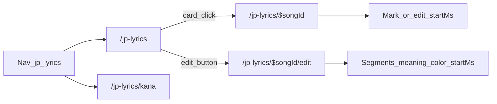

# Japanese Lyrics

Personal Japanese lyric cards: kana chart, song list, line editor (Japanese / kana / Chinese / timestamp / phrase colors), and a browse page that scrolls by timestamps. There is **no in-app audio player**.

This document is the source of truth for the first implementation. Follow existing layers (idiom / raid-run): UI route → `lib/api/*` → `@sidui/api-client` → API endpoint → service → repository → `@sidui/db`. Skip `domain/model/` — validation stays in the service and UI `-lib/` helpers.

User-facing copy is Simplified Chinese. Do not use 学习 / 考试 / 跟读 / 测验 in nav or page titles.

## Decisions

- Signed-in user feature only (`auth: roleUser`). No admin pages or `/admin/lyric-*` routes.
- Each song belongs to one user (`lyric_song.user_id`). List / get / update / delete are scoped to the session user. Another user's song is **404**, not 403.
- Japanese and kana are aligned with **plan A**: split both strings on `/`, trim parts, require the same non-empty part count. Chinese meaning is per line, not per segment.
- Selecting Japanese or kana applies a color to the same segment(s). Both rows highlight together.
- Colors are a fixed token palette, not a free color picker.
- Browse page always shows Japanese, kana, and Chinese. No cloze / hide-layer mode.
- Timestamps are written in two ways: **tap-to-mark** on the browse page while an external player runs, and **direct edit** (`m:ss.cc`) on the edit page and the browse page.
- Clicking a list card opens browse. Edit is a separate button.

## Out of scope (v1)

- In-app song playback or audio hosting
- LRC import (JSON song backup import/export is in scope)
- Auto kana, auto segmentation, auto translation
- Shared / public song library
- Admin CRUD
- Quizzes, cloze, or “study” modes
- Per-character karaoke timings

## Information architecture

```text
Nav: 日语歌词
  ├─ 歌曲        /jp-lyrics
  └─ 五十音图    /jp-lyrics/kana

/jp-lyrics                     song cards (owner only)
/jp-lyrics/kana                static kana chart
/jp-lyrics/$songId             browse (scroll + mark + edit one timestamp)
/jp-lyrics/$songId/edit        edit lines, colors, timestamps
```



## Data model

No physical foreign keys. Every table has `id` (UUID), `created_at`, `updated_at` (`$onUpdate`). File: `packages/db/schema/lyric-song.ts`, re-export from `schema/index.ts`.

### `lyric_song`

| Column | Type | Notes |
|---|---|---|
| `id` | uuid PK | `defaultRandom()` |
| `user_id` | text not null | Better Auth user id; index |
| `title` | text not null | Japanese song title |
| `meaning` | text not null | Chinese song title |
| `artist` | text | nullable |
| `created_at` | timestamptz | |
| `updated_at` | timestamptz | |

### `lyric_line`

| Column | Type | Notes |
|---|---|---|
| `id` | uuid PK | |
| `song_id` | uuid not null | app-layer ownership via parent song |
| `position` | integer not null | 0-based display order |
| `segments` | jsonb not null | see below |
| `meaning` | text | nullable Chinese gloss |
| `start_ms` | integer | nullable; milliseconds from song start |
| `created_at` | timestamptz | |
| `updated_at` | timestamptz | |

Unique `(song_id, position)`. Index `song_id`.

Japanese and kana are **not** stored as extra whole-line columns. Render with `segments.map(s => s.text).join('')` and `segments.map(s => s.kana).join('')`.

### Segment JSON

```ts
type LyricColorToken =
  | 'rose'
  | 'amber'
  | 'lime'
  | 'sky'
  | 'violet'
  | 'pink'
  | 'orange'
  | 'teal';

type LyricSegment = {
  text: string;
  kana: string;
  color: LyricColorToken | null;
};
```

Adjacent segments with the same non-null color are one sung phrase.

Map tokens to Tailwind semantic classes in the UI (readable on light and dark). Do not persist hex values.

## Segment and timestamp rules

Delimiter: `/`. Split, trim, drop empty parts. Example:

```text
Japanese: 君の / 名は
Kana:     きみの / なは
→ [{ text: "君の", kana: "きみの", color: null }, { text: "名は", kana: "なは", color: null }]
```

Validation (API must re-check; UI shows the same errors before save):

- At least one segment
- Every `text` and `kana` is non-empty after trim
- Japanese part count equals kana part count
- `color` is a palette token or `null`
- `startMs`, if set, is an integer `>= 0`

Timestamp display and input: `m:ss.cc` (centiseconds). Examples: `0:00.00`, `1:23.45`. Storage is always integer milliseconds (`1:23.45` → `83450`). Empty input clears `startMs`.

Current line for a clock value `currentMs`: the last line whose `startMs != null` and `startMs <= currentMs`. Lines with `startMs == null` are ignored for auto-scroll. If none match, no line is current.

Line end is implicit: next timed line’s `startMs`, or last timed line + 4000 ms for the virtual clock length.

## API

Mount `lyricSongRoute` on `apps/api/src/index.ts` **before** `export type App`. Register the OpenAPI tag in `apps/api/src/app.ts`. All handlers: `auth: roleUser`. User-facing exception messages in Chinese; OpenAPI summaries in English.

Base path: `/api/v1/lyric-songs`.

| Method | Path | Purpose |
|---|---|---|
| `GET` | `/lyric-songs` | List current user’s songs (no pagination in v1) |
| `POST` | `/lyric-songs` | Create `{ title, meaning, artist? }` |
| `GET` | `/lyric-songs/export` | Export all of the current user’s songs as a JSON document |
| `POST` | `/lyric-songs/import` | Import a JSON file; skip songs whose `title` already exists |
| `GET` | `/lyric-songs/:id` | Detail + lines ordered by `position` |
| `PATCH` | `/lyric-songs/:id` | Update `{ title?, meaning?, artist? }` |
| `DELETE` | `/lyric-songs/:id` | Delete song; service also deletes its lines |
| `PUT` | `/lyric-songs/:id/lines` | Replace all lines (editor save) |
| `PATCH` | `/lyric-songs/:id/line-timings` | Update `startMs` by line id (mark / manual fix) |

Mount `/export` and `/import` **before** `/:id`. `title` and `meaning` are required on create (trim, non-empty). `artist` stays optional.

JSON document (export and import share this shape; no `id` / `userId` / timestamps):

```ts
{
  version: 1,
  songs: Array<{
    title: string;
    meaning: string;
    artist?: string | null;
    lines: Array<{
      segments: Array<{ text: string; kana: string; color: LyricColorToken | null }>;
      meaning?: string | null;
      startMs?: number | null;
    }>;
  }>;
}
```

Import conflict: skip when the trimmed `title` already exists for the current user. Per-song failures do not roll back other songs. Whole-file parse errors use `LYRIC_SONG_IMPORT_INVALID`.

`PUT .../lines` body (parsed `segments` is the only wire shape):

```ts
{
  lines: Array<{
    segments: Array<{ text: string; kana: string; color: LyricColorToken | null }>;
    meaning?: string | null;
    startMs?: number | null;
  }>;
}
```

The UI parses `/`-delimited Japanese and kana locally, then sends `segments`. The API re-validates.

`PATCH .../line-timings` body:

```ts
{
  timings: Array<{ lineId: string; startMs: number | null }>;
}
```

Unknown `lineId` or a line not on this song → 400. Song not owned → 404.

Error codes to add in `ERROR_CODES`:

- `LYRIC_SONG_NOT_FOUND`
- `LYRIC_LINE_INVALID` (segment / color / timestamp / timing id)
- `LYRIC_SONG_IMPORT_INVALID` (unreadable JSON / bad version / missing `songs`)

Log mutations in the service (`info` on success). Do not log 404 validation paths.

UI wrapper: `apps/ui/src/lib/api/lyric-songs-api.ts` (not under `api/admin/`). Derive types with `Awaited<ReturnType<typeof fn>>`.

## UI conventions

- Routes under `apps/ui/src/routes/_authenticated/jp-lyrics/`
- Page component stays in the route file; children in `-components/`; helpers in `-lib/`
- Forms: route container owns React Query; `*FormComponent` is presentational
- Shared delete: existing `ConfirmDialog`
- Tests mirror `src/` under `tests/`; mock API wrappers; Chinese copy is the contract
- Update [apps/ui/src/routes/_authenticated/-lib/nav-items.ts](apps/ui/src/routes/_authenticated/-lib/nav-items.ts) and [apps/ui/tests/routes/_authenticated/-lib/nav-items.test.ts](apps/ui/tests/routes/_authenticated/-lib/nav-items.test.ts): `visibleNavItems(ROLE_USER)` must include `日语歌词`

Browse page clock is a virtual timer (`requestAnimationFrame` or interval). Start / pause / seek do not touch `<audio>`.

Mark-timing state machine on browse:

1. **Idle** — clock is 0 or last seek position; auto-follow if timings exist
2. **Running** — user hits 开始 (sync with an external player); `currentMs` advances
3. **Mark** — 标记 or Space writes `currentMs` onto the next line with `startMs == null`, then focuses that line
4. **Undo** — 撤销 clears `startMs` on the last marked line (session stack is enough)
5. Persist marks with `PATCH .../line-timings` (debounce or save after each mark / undo)

## File checklist (target)

**db**

- `packages/db/schema/lyric-song.ts`
- `packages/db/schema/index.ts` (re-export)
- generated migration (ask before `db:migrate`)

**api**

- `apps/api/src/infrastructure/repository/lyric-song-repository.ts`
- `apps/api/src/infrastructure/repository/lyric-line-repository.ts`
- `apps/api/src/application/service/lyric-song-service.ts`
- `apps/api/src/interface/schema/lyric-song-schema.ts`
- `apps/api/src/interface/endpoint/lyric-song-route.ts`
- `apps/api/src/index.ts`, `apps/api/src/app.ts`, `apps/api/src/shared/exception/error-code.ts`
- `apps/api/src/shared/util/lyric.ts`
- `apps/api/tests/application/service/lyric-song-service.test.ts`
- `apps/api/tests/interface/endpoint/lyric-song-route.test.ts`
- `apps/api/tests/shared/util/lyric.test.ts`

**ui**

- `apps/ui/src/lib/api/lyric-songs-api.ts`
- `apps/ui/src/routes/_authenticated/jp-lyrics/index.tsx`
- `apps/ui/src/routes/_authenticated/jp-lyrics/kana/index.tsx`
- `apps/ui/src/routes/_authenticated/jp-lyrics/$songId/index.tsx`
- `apps/ui/src/routes/_authenticated/jp-lyrics/$songId/edit/index.tsx`
- `jp-lyrics/-lib/` — kana chart data, segment parse, colors, timestamps, clock
- `jp-lyrics/-components/` — cards, editor rows, color palette, browse scroller, mark controls
- matching files under `apps/ui/tests/`

---

## Stories

Implement **in order**. Each story is independently reviewable. Do not start S8+ until S6 routes exist. Do not start S9 until S4 works. Do not start S14 UI until S8 exists. Include unit tests in the same story, not only in S13.

### S1 — Database schema

**Description.** Add owner-scoped song and line tables so later stories have persistence.

**Work.**

- Create `lyric_song` and `lyric_line` in `packages/db/schema/lyric-song.ts` (two-word table names, no `.references()`).
- Index `lyric_song.user_id` and `lyric_line.song_id`; unique `(song_id, position)`.
- Re-export from `schema/index.ts`.
- Run `bun run --filter @sidui/db db:generate`.
- **Do not** run `db:migrate` until the user confirms.

**Done when.** Schema compiles; migration SQL exists; `segments` is jsonb; `start_ms` is nullable integer.

### S2 — Segment, color, and timestamp helpers

**Description.** Pure functions for `/` parsing, palette checks, `m:ss.cc` ↔ ms, and “current line” lookup. Used by API validation and the editor/browse UI. Duplicate the small helpers in API and UI (no new package). Keep both test suites in sync with this spec.

**Work.**

- `splitLyricParts(raw: string): string[]` — split on `/`, trim, drop empties.
- `parseLyricSegments(japanese: string, kana: string): LyricSegment[]` — throw/return error if counts differ or a part is empty.
- `isLyricColorToken(value: string): boolean`
- `formatLyricTimestamp(ms: number): string` / `parseLyricTimestamp(text: string): number | null`
- `findCurrentLyricLineIndex(lines, currentMs): number | null`
- `lyricClockDurationMs(lines): number` — last timed `startMs` + 4000, or 0
- Tests: equal parts, mismatch, extra slashes, empty input, timestamp round-trip, current-line edges (all null, before first, between two, after last)

**Done when.** Helpers are covered ≥90% functions/lines in the package that owns them. No React / HTTP inside these modules.

### S3 — API: song CRUD

**Description.** Create, list, read, rename, and delete the current user’s songs. Detail includes lines (empty array for a new song).

**Work.**

- Repositories: list by `userId`, get by id, insert, update title/meaning/artist, delete song + its lines in the service.
- Service methods: `listLyricSongs`, `createLyricSong`, `getLyricSong`, `updateLyricSong`, `deleteLyricSong`. Always filter `userId`. Create requires trimmed non-empty `title` and `meaning`.
- Route group `/lyric-songs` with `auth: roleUser`.
- Error code `LYRIC_SONG_NOT_FOUND`.
- Wire route in `index.ts` and swagger tag in `app.ts`.
- Service tests (mocked repos): owner hit, other user’s id → not found, create maps `user.id`.
- Route tests via `app.handle(Request)` with mocked service/auth.

**Done when.** A user can only see and mutate their own songs. OpenAPI documents the five endpoints.

### S4 — API: replace lines

**Description.** Editor save: replace every line of a song in one `PUT`. This is a document write, not per-line CRUD.

**Work.**

- `replaceLyricLines(userId, songId, lines)` in a transaction: delete existing lines, insert new ones with `position` 0..n-1.
- Validate segments and optional `startMs` / colors (`LYRIC_LINE_INVALID`).
- Empty `lines` array is allowed (clear the song).
- Service + route tests: happy path, segment count mismatch, invalid color, song not owned.

**Done when.** GET after PUT returns the same order, texts, kana, meaning, colors, and timestamps.

### S5 — API: patch line timings

**Description.** Browse-page mark/undo and inline timestamp fixes without rewriting segment text.

**Work.**

- `updateLyricLineTimings(userId, songId, timings)`
- Update only `start_ms` for given line ids that belong to the song
- `startMs: null` clears a mark
- Reject unknown ids (`LYRIC_LINE_INVALID`)
- Tests: partial update, clear, foreign line id, not owned

**Done when.** PUT lines is unchanged; timings can be updated independently.

### S6 — UI shell: client, nav, empty routes

**Description.** Logged-in users can open the four URLs from the sidebar. Pages may be placeholders until later stories.

**Work.**

- `lib/api/lyric-songs-api.ts` wrappers for all endpoints from S3–S5 and S14
- Nav group `日语歌词` with children `歌曲` → `/jp-lyrics`, `五十音图` → `/jp-lyrics/kana` (no `requiredRole`; all signed-in users)
- Route files: list, kana, `$songId`, `$songId/edit`
- Chinese titles via existing document-title helpers
- Nav tests: user sees the group; `getActiveNavTitle` for the four paths

**Done when.** Sidebar shows 日语歌词 for `ROLE_USER` and `ROLE_ADMIN`. Visiting each path does not 404. No “学习” copy.

### S7 — Kana chart page

**Description.** Static hiragana / katakana reference. No API, no quiz.

**Work.**

- Static data in `jp-lyrics/-lib/kana-chart.ts`: gojuon, dakuten, handakuten, yoon
- Each cell: hiragana, katakana, one romaji system (Hébon), locked in the data file
- UI: tables, 平假名 / 片假名 side by side
- Optional switch: show/hide romaji
- Click a cell: highlight the matching hiragana + katakana pair
- Tests: data completeness (46 清音 + 浊音/半浊/拗音 rows you include), toggle, highlight callback

**Done when.** Page is usable offline (no network). Copy is 五十音图, not a test.

### S8 — Song list

**Description.** Card list of the current user’s songs; create and delete.

**Work.**

- `useQuery` list + `useMutation` create/delete with toast + invalidate
- Card: Japanese title, Chinese title (`meaning`), artist (if any), line count if the list payload includes it (add `lineCount` on list DTO if cheap)
- Card click → `/jp-lyrics/$songId`
- 编辑 button → `/jp-lyrics/$songId/edit` (`stopPropagation`)
- Create dialog: 歌曲名 and 中文歌名 required, 歌手 optional → POST → navigate to edit
- Toolbar: 导入 / 导出 (S14)
- Delete via `ConfirmDialog`
- Empty state in Chinese
- Component tests: click card vs edit, validation, delete confirm

**Done when.** Owner can add a song and open browse or edit. Another user’s songs never appear.

### S9 — Edit page: text, meaning, timestamps

**Description.** Edit all lines as a document: Japanese, kana (`/` aligned), Chinese, and typed timestamps. Save with `PUT .../lines`.

**Work.**

- Load detail; local state for rows (add / remove / reorder)
- Each row: 日语歌词, 假名, 中文意思, 时间戳 (`m:ss.cc`)
- Live validation: part-count mismatch shows a Chinese error on that row; Save disabled while any row is invalid
- Bulk paste (optional but recommended): split Japanese by newline into new rows; kana/meaning empty
- Persist colors already on segments when text part count is unchanged; drop colors if the count changes
- Container mutation + toast; presentational `LyricLineForm` / list
- Tests: parse mismatch blocks save, timestamp parse, reorder updates `position` on save payload

**Done when.** User can enter a multi-line song, save, reload, and see the same text/meaning/times. Color UI may still be missing (S10).

### S10 — Edit page: linked phrase colors

**Description.** Select Japanese or kana in a line and paint the covered segments so both rows share the color.

**Work.**

- Render each row’s Japanese and kana as segment chips or selectable runs (not a raw textarea for the colored view; keep textareas for editing `/` source, or switch to chip editor — chip-per-segment is enough)
- Palette of the 8 tokens + clear
- Selection of one or more adjacent segments sets `color` on those segments
- Painting from kana uses the same segment ids as Japanese
- Preview matches browse coloring
- Tests: select JP paints kana; select kana paints JP; clear; token list

**Done when.** Same segment cannot show two different colors on the two rows. Refresh after save keeps colors (S4 `colors` / `segments`).

### S11 — Browse page: display, clock, drag

**Description.** Read-only lyric view: all three layers, colors, and player-like scrolling **without audio**.

**Work.**

- Render lines: Japanese, kana, Chinese; apply segment colors
- Virtual clock: play / pause, `currentMs`, highlight current timed line, scroll it to center
- Drag the lyric list (or a seek bar) to change `currentMs` / current line; while dragging, pause auto-follow; on release, snap to the nearest timed line or keep the interpolated time — pick snap-to-line and document it in the helper tests
- Lines with no `startMs` stay visible but never become “current” via the clock
- Tests: `findCurrentLyricLineIndex`, clock duration, drag snap helper; component tests for play/pause and current-line label

**Done when.** With timestamps present, play scrolls. Drag changes the current line. Japanese / kana / Chinese are all visible. No `<audio>`.

### S12 — Browse page: tap-to-mark and manual timestamp edit

**Description.** Listen once in an external player, tap to stamp each line, and fix a line by typing a time.

**Work.**

- Controls: 开始, 标记, 撤销, plus existing play/pause for replay
- 开始 sets `currentMs = 0` and starts the clock (user syncs with the external track)
- 标记 / Space: assign `currentMs` to the next untimed line; if all lines are timed, do nothing (or toast 已全部标记)
- 撤销: clear the last stamp from this marking session
- Persist via `updateLyricLineTimings` after mark/undo
- Per-line timestamp field on browse (or a small dialog) for direct edit; same `m:ss.cc` parser as S9
- Keyboard: Space = mark only while the mark session is running (do not steal Space from play/pause if both exist — use Space for mark when running from 开始, and a separate 播放/暂停 button)
- Tests: mark order, undo stack, Space handler, PATCH payload, ignore already-timed lines

**Done when.** One pass of 开始 + 标记 fills `startMs` in order. User can type a correction. Replay (S11) then follows those times.

### S14 — Song JSON import / export

**Description.** Backup and restore the current user’s songs as one JSON file from the list page.

**Work.**

- `GET /lyric-songs/export` returns `{ version: 1, songs }` for the session user (empty list allowed).
- `POST /lyric-songs/import` accepts `t.File` (`maxSize: '10m'`). Skip existing titles; validate each song with the same segment rules as S4.
- Response: `{ created, skipped, failed, errors: Array<{ index, title, message }> }`.
- UI (after S8): import dialog + export download (`lyric-songs.json`). Toast the import summary.
- Tests: empty export, round-trip, skip by title, invalid JSON, one bad song does not block the rest.

**Done when.** Exporting then importing on a second account creates the same titles, meanings, artists, segments, line meanings, colors, and timestamps. Re-importing the same file skips every song.

### S13 — Verification and nav contract

**Description.** Close the feature: coverage, types, and Chinese copy.

**Work.**

- `bun run --filter @sidui/db` check if needed after schema
- `bun run --filter @sidui/api check` and `typecheck` and `test` / `test:cov`
- `bun run --filter @sidui/ui check` and `typecheck` and `test` / `test:cov`
- Nav tests include 日语歌词 for user and admin
- Grep UI copy: no 学习 / 考试 / 跟读 / 测验
- Confirm migrate was applied only after user approval

**Done when.** Check and typecheck pass for touched packages. New files meet the 90% coverage bar.

## Suggested implementation order

```text
S1 schema
 → S2 helpers
 → S3 CRUD → S4 lines → S5 timings
 → S6 shell → S7 kana → S8 list → S14 import/export
 → S9 edit text → S10 colors
 → S11 browse scroll → S12 mark
 → S13 verify
```

S7 can run in parallel with S3–S5. S14 UI depends on S8; S14 API depends on S3–S4 and can start earlier. S10 depends on S9. S12 depends on S5 and S11. S14 can run in parallel with S9.
